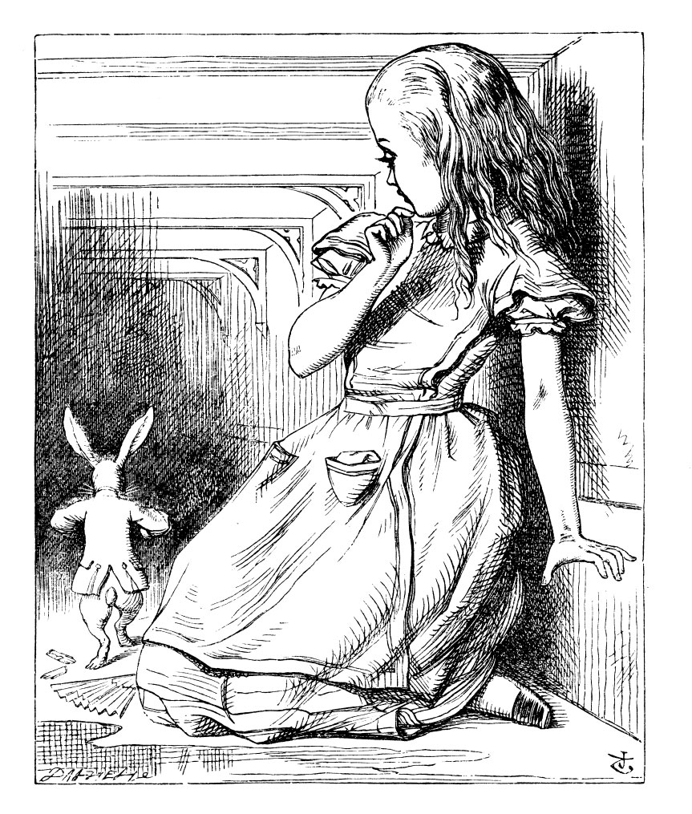

== The Pool of Tears

image::images/05.jpg[Bob stretched tall, align=center]

"Curiouser and curiouser!" cried Bob (he was so much surprised, that for the moment he quite forgot how to speak good English); "now I'm opening out like the largest telescope that ever was! Good-bye, feet!" (for when he looked down at his feet, they seemed to be almost out of sight, they were getting so far off). "Oh, my poor little feet, I wonder who will put on your shoes and stockings for you now, dears? I'm sure _I_ shan't be able! I shall be a great deal too far off to trouble myself about you: you must manage the best way you can;—but I must be kind to them," thought Bob, "or perhaps they won't walk the way I want to go! Let me see: I'll give them a new pair of boots every Christmas."

And he went on planning to himself how he would manage it. "They must go by the carrier," he thought; "and how funny it'll seem, sending presents to one's own feet! And how odd the directions will look!

....
    Bob's Right Foot, Esq.,
       Hearthrug,
         near the Fender,
           (with Bob's love).
....

Oh dear, what nonsense I'm talking!"

Just then his head struck against the roof of the hall: in fact he was now more than nine feet high, and he at once took up the little golden key and hurried off to the garden door.

Poor Bob! It was as much as he could do, lying down on one side, to look through into the garden with one eye; but to get through was more hopeless than ever: he sat down and began to cry again.

"You ought to be ashamed of yourself," said Bob, "a great boy like you," (he might well say this), "to go on crying in this way! Stop this moment, I tell you!" But he went on all the same, shedding gallons of tears, until there was a large pool all round him, about four inches deep and reaching half down the hall.

After a time he heard a little pattering of feet in the distance, and he hastily dried his eyes to see what was coming. It was the White Rabbit returning, splendidly dressed, with a pair of white kid gloves in one hand and a large fan in the other: he came trotting along in a great hurry, muttering to himself as he came, "Oh! the Duchess, the Duchess! Oh! won't she be savage if I've kept her waiting!" Bob felt so desperate that he was ready to ask help of any one; so, when the Rabbit came near him, he began, in a low, timid voice, "If you please, sir—" The Rabbit started violently, dropped the white kid gloves and the fan, and skurried away into the darkness as hard as he could go.

Bob took up the fan and gloves, and, as the hall was very hot, he kept fanning himself all the time he went on talking: "Dear, dear! How queer everything is to-day! And yesterday things went on just as usual. I wonder if I've been changed in the night? Let me think: was I the same when I got up this morning? I almost think I can remember feeling a little different. But if I'm not the same, the next question is, Who in the world am I? Ah, _that's_ the great puzzle!" And he began thinking over all the children he knew that were of the same age as himself, to see if he could have been changed for any of them.

"I'm sure I'm not Ada," he said, "for her hair goes in such long ringlets, and mine doesn't go in ringlets at all; and I'm sure I can't be Mabel, for I know all sorts of things, and she, oh! she knows such a very little! Besides, _she's_ she, and _I'm_ I, and—oh dear, how puzzling it all is! I'll try if I know all the things I used to know. Let me see: four times five is twelve, and four times six is thirteen, and four times seven is—oh dear! I shall never get to twenty at that rate! However, the Multiplication Table doesn't signify: let's try Geography. London is the capital of Paris, and Paris is the capital of Rome, and Rome—no, _that's_ all wrong, I'm certain! I must have been changed for Mabel! I'll try and say '_How doth the little_—'" and he crossed his hands on his lap as if he were saying lessons, and began to repeat it, but his voice sounded hoarse and strange, and the words did not come the same as they used to do:—

....
"How doth the little crocodile
    Improve his shining tail,
And pour the waters of the Nile
    On every golden scale!

"How cheerfully he seems to grin,
    How neatly spread his claws,
And welcome little fishes in
    With gently smiling jaws!"
....

"I'm sure those are not the right words," said poor Bob, and his eyes filled with tears again as he went on, "I must be Mabel after all, and I shall have to go and live in that poky little house, and have next to no toys to play with, and oh! ever so many lessons to learn! No, I've made up my mind about it; if I'm Mabel, I'll stay down here! It'll be no use their putting their heads down and saying 'Come up again, dear!' I shall only look up and say 'Who am I then? Tell me that first, and then, if I like being that person, I'll come up: if not, I'll stay down here till I'm somebody else'—but, oh dear!" cried Bob, with a sudden burst of tears, "I do wish they _would_ put their heads down! I am so _very_ tired of being all alone here!"

As he said this he looked down at his hands, and was surprised to see that he had put on one of the Rabbit's little white kid gloves while he was talking. "How _can_ I have done that?" he thought. "I must be growing small again." He got up and went to the table to measure himself by it, and found that, as nearly as he could guess, he was now about two feet high, and was going on shrinking rapidly: he soon found out that the cause of this was the fan he was holding, and he dropped it hastily, just in time to avoid shrinking away altogether.

"That _was_ a narrow escape!" said Bob, a good deal frightened at the sudden change, but very glad to find himself still in existence; "and now for the garden!" and he ran with all speed back to the little door: but, alas! the little door was shut again, and the little golden key was lying on the glass table as before, "and things are worse than ever," thought the poor child, "for I never was so small as this before, never! And I declare it's too bad, that it is!"

As he said these words his foot slipped, and in another moment, splash! he was up to his chin in salt water. His first idea was that he had somehow fallen into the sea, "and in that case I can go back by railway," he said to himself. (Bob had been to the seaside once in his life, and had come to the general conclusion, that wherever you go to on the English coast you find a number of bathing machines in the sea, some children digging in the sand with wooden spades, then a row of lodging houses, and behind them a railway station.) However, he soon made out that he was in the pool of tears which he had wept when he was nine feet high.

image::images/07.jpg[Bob in pool of tears, align=center]

"I wish I hadn't cried so much!" said Bob, as he swam about, trying to find his way out. "I shall be punished for it now, I suppose, by being drowned in my own tears! That _will_ be a queer thing, to be sure! However, everything is queer to-day."

Just then he heard something splashing about in the pool a little way off, and he swam nearer to make out what it was: at first he thought it must be a walrus or hippopotamus, but then he remembered how small he was now, and he soon made out that it was only a mouse that had slipped in like himself.

"Would it be of any use, now," thought Bob, "to speak to this mouse? Everything is so out-of-the-way down here, that I should think very likely it can talk: at any rate, there's no harm in trying." So he began: "O Mouse, do you know the way out of this pool? I am very tired of swimming about here, O Mouse!" (Bob thought this must be the right way of speaking to a mouse: he had never done such a thing before, but he remembered having seen in his brother's Latin Grammar, "A mouse—of a mouse—to a mouse—a mouse—O mouse!") The Mouse looked at him rather inquisitively, and seemed to him to wink with one of its little eyes, but it said nothing.

"Perhaps it doesn't understand English," thought Bob; "I daresay it's a French mouse, come over with William the Conqueror." (For, with all his knowledge of history, Bob had no very clear notion how long ago anything had happened.) So he began again: "Où est ma chatte?" which was the first sentence in his French lesson-book. The Mouse gave a sudden leap out of the water, and seemed to quiver all over with fright. "Oh, I beg your pardon!" cried Bob hastily, afraid that he had hurt the poor animal's feelings. "I quite forgot you didn't like cats."

"Not like cats!" cried the Mouse, in a shrill, passionate voice. "Would _you_ like cats if you were me?"

"Well, perhaps not," said Bob in a soothing tone: "don't be angry about it. And yet I wish I could show you our cat Dinah: I think you'd take a fancy to cats if you could only see her. She is such a dear quiet thing," Bob went on, half to himself, as he swam lazily about in the pool, "and she sits purring so nicely by the fire, licking her paws and washing her face—and she is such a nice soft thing to nurse—and she's such a capital one for catching mice—oh, I beg your pardon!" cried Bob again, for this time the Mouse was bristling all over, and he felt certain it must be really offended. "We won't talk about her any more if you'd rather not."

"We indeed!" cried the Mouse, who was trembling down to the end of his tail. "As if _I_ would talk on such a subject! Our family always _hated_ cats: nasty, low, vulgar things! Don't let me hear the name again!"

"I won't indeed!" said Bob, in a great hurry to change the subject of conversation. "Are you—are you fond—of—of dogs?" The Mouse did not answer, so Bob went on eagerly: "There is such a nice little dog near our house I should like to show you! A little bright-eyed terrier, you know, with oh, such long curly brown hair! And it'll fetch things when you throw them, and it'll sit up and beg for its dinner, and all sorts of things—I can't remember half of them—and it belongs to a farmer, you know, and he says it's so useful, it's worth a hundred pounds! He says it kills all the rats and—oh dear!" cried Bob in a sorrowful tone, "I'm afraid I've offended it again!" For the Mouse was swimming away from him as hard as it could go, and making quite a commotion in the pool as it went.

So he called softly after it, "Mouse dear! Do come back again, and we won't talk about cats or dogs either, if you don't like them!" When the Mouse heard this, it turned round and swam slowly back to him: its face was quite pale (with passion, Bob thought), and it said in a low trembling voice, "Let us get to the shore, and then I'll tell you my history, and you'll understand why it is I hate cats and dogs."

It was high time to go, for the pool was getting quite crowded with the birds and animals that had fallen into it: there were a Duck and a Dodo, a Lory and an Eaglet, and several other curious creatures. Bob led the way, and the whole party swam to the shore.
