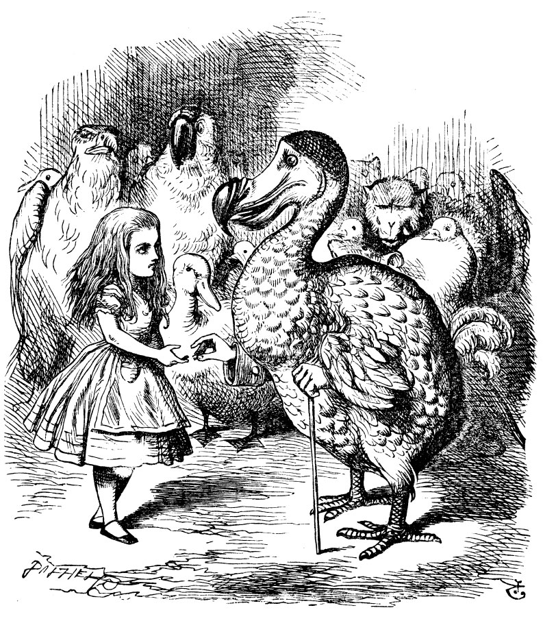

== A Caucus-Race and a Long Tale

They were indeed a queer-looking party that assembled on the bank—the birds with draggled feathers, the animals with their fur clinging close to them, and all dripping wet, cross, and uncomfortable.

The first question of course was, how to get dry again: they had a consultation about this, and after a few minutes it seemed quite natural to Bob to find himself talking familiarly with them, as if he had known them all his life. Indeed, he had quite a long argument with the Lory, who at last turned sulky, and would only say, "I am older than you, and must know better;" and this Bob would not allow without knowing how old it was, and, as the Lory positively refused to tell its age, there was no more to be said.

At last the Mouse, who seemed to be a person of authority among them, called out, "Sit down, all of you, and listen to me! _I'll_ soon make you dry enough!" They all sat down at once, in a large ring, with the Mouse in the middle. Bob kept his eyes anxiously fixed on it, for he felt sure he would catch a bad cold if he did not get dry very soon.

"Ahem!" said the Mouse with an important air, "are you all ready? This is the driest thing I know. Silence all round, if you please! 'William the Conqueror, whose cause was favoured by the pope, was soon submitted to by the English, who wanted leaders, and had been of late much accustomed to usurpation and conquest. Edwin and Morcar, the earls of Mercia and Northumbria—'"

"Ugh!" said the Lory, with a shiver.

"I beg your pardon!" said the Mouse, frowning, but very politely: "Did you speak?"

"Not I!" said the Lory hastily.

"I thought you did," said the Mouse. "—I proceed. 'Edwin and Morcar, the earls of Mercia and Northumbria, declared for him: and even Stigand, the patriotic archbishop of Canterbury, found it advisable—'"

"Found _what_?" said the Duck.

"Found _it_," the Mouse replied rather crossly: "of course you know what 'it' means."

"I know what 'it' means well enough, when _I_ find a thing," said the Duck: "it's generally a frog or a worm. The question is, what did the archbishop find?"

The Mouse did not notice this question, but hurriedly went on, "'—found it advisable to go with Edgar Atheling to meet William and offer him the crown. William's conduct at first was moderate. But the insolence of his Normans—' How are you getting on now, my dear?" it continued, turning to Bob as it spoke.

"As wet as ever," said Bob in a melancholy tone: "it doesn't seem to dry me at all."

"In that case," said the Dodo solemnly, rising to its feet, "I move that the meeting adjourn, for the immediate adoption of more energetic remedies—"

"Speak English!" said the Eaglet. "I don't know the meaning of half those long words, and, what's more, I don't believe you do either!" And the Eaglet bent down its head to hide a smile: some of the other birds tittered audibly.

"What I was going to say," said the Dodo in an offended tone, "was, that the best thing to get us dry would be a Caucus-race."

"What _is_ a Caucus-race?" said Bob; not that he wanted much to know, but the Dodo had paused as if it thought that _somebody_ ought to speak, and no one else seemed inclined to say anything.

"Why," said the Dodo, "the best way to explain it is to do it." (And, as you might like to try the thing yourself, some winter day, I will tell you how the Dodo managed it.)

First it marked out a race-course, in a sort of circle, ("the exact shape doesn't matter," it said,) and then all the party were placed along the course, here and there. There was no "One, two, three, and away," but they began running when they liked, and left off when they liked, so that it was not easy to know when the race was over. However, when they had been running half an hour or so, and were quite dry again, the Dodo suddenly called out "The race is over!" and they all crowded round it, panting, and asking, "But who has won?"

This question the Dodo could not answer without a great deal of thought, and it sat for a long time with one finger pressed upon its forehead (the position in which you usually see Shakespeare, in the pictures of him), while the rest waited in silence. At last the Dodo said, "_Everybody_ has won, and all must have prizes."

"But who is to give the prizes?" quite a chorus of voices asked.

"Why, _he_, of course," said the Dodo, pointing to Bob with one finger; and the whole party at once crowded round him, calling out in a confused way, "Prizes! Prizes!"

Bob had no idea what to do, and in despair he put his hand in his pocket, and pulled out a box of comfits, (luckily the salt water had not got into it), and handed them round as prizes. There was exactly one a-piece, all round.

"But he must have a prize himself, you know," said the Mouse.

"Of course," the Dodo replied very gravely. "What else have you got in your pocket?" he went on, turning to Bob.

"Only a thimble," said Bob sadly.

"Hand it over here," said the Dodo.

Then they all crowded round him once more, while the Dodo solemnly presented the thimble, saying "We beg your acceptance of this elegant thimble;" and, when it had finished this short speech, they all cheered.

Bob thought the whole thing very absurd, but they all looked so grave that he did not dare to laugh; and, as he could not think of anything to say, he simply bowed, and took the thimble, looking as solemn as he could.

The next thing was to eat the comfits: this caused some noise and confusion, as the large birds complained that they could not taste theirs, and the small ones choked and had to be patted on the back. However, it was over at last, and they sat down again in a ring, and begged the Mouse to tell them something more.

"You promised to tell me your history, you know," said Bob, "and why it is you hate—C and D," he added in a whisper, half afraid that it would be offended again.

"Mine is a long and a sad tale!" said the Mouse, turning to Bob, and sighing.

"It _is_ a long tail, certainly," said Bob, looking down with wonder at the Mouse's tail; "but why do you call it sad?" And he kept on puzzling about it while the Mouse was speaking, so that his idea of the tale was something like this:—

....
         "Fury said to a
         mouse, That he
        met in the
       house,
     'Let us
      both go to
       law: I will
        prosecute
         you.—Come,
           I'll take no
           denial; We
          must have a
        trial: For
      really this
     morning I've
    nothing
    to do.'
      Said the
      mouse to the
       cur, 'Such
        a trial,
         dear sir,
            With
          no jury
        or judge,
       would be
      wasting
      our
      breath.'
        'I'll be
        judge, I'll
         be jury,'
             Said
         cunning
          old Fury:
          'I'll
          try the
            whole
            cause,
              and
           condemn
           you
          to
           death.'"
....

image::images/10.jpg[Mouse telling story to birds and Bob, align=center]

"You are not attending!" said the Mouse to Bob severely. "What are you thinking of?"

"I beg your pardon," said Bob very humbly: "you had got to the fifth bend, I think?"

"I had _not!_" cried the Mouse, sharply and very angrily.

"A knot!" said Bob, always ready to make himself useful, and looking anxiously about him. "Oh, do let me help to undo it!"

"I shall do nothing of the sort," said the Mouse, getting up and walking away. "You insult me by talking such nonsense!"

"I didn't mean it!" pleaded poor Bob. "But you're so easily offended, you know!"

The Mouse only growled in reply.

"Please come back and finish your story!" Bob called after it; and the others all joined in chorus, "Yes, please do!" but the Mouse only shook its head impatiently, and walked a little quicker.

"What a pity it wouldn't stay!" sighed the Lory, as soon as it was quite out of sight; and an old Crab took the opportunity of saying to her daughter "Ah, my dear! Let this be a lesson to you never to lose _your_ temper!" "Hold your tongue, Ma!" said the young Crab, a little snappishly. "You're enough to try the patience of an oyster!"

"I wish I had our Dinah here, I know I do!" said Bob aloud, addressing nobody in particular. "She'd soon fetch it back!"

"And who is Dinah, if I might venture to ask the question?" said the Lory.

Bob replied eagerly, for he was always ready to talk about his pet: "Dinah's our cat. And she's such a capital one for catching mice you can't think! And oh, I wish you could see her after the birds! Why, she'll eat a little bird as soon as look at it!"

This speech caused a remarkable sensation among the party. Some of the birds hurried off at once: one old Magpie began wrapping itself up very carefully, remarking, "I really must be getting home; the night-air doesn't suit my throat!" and a Canary called out in a trembling voice to its children, "Come away, my dears! It's high time you were all in bed!" On various pretexts they all moved off, and Bob was soon left alone.

"I wish I hadn't mentioned Dinah!" he said to himself in a melancholy tone. "Nobody seems to like her, down here, and I'm sure she's the best cat in the world! Oh, my dear Dinah! I wonder if I shall ever see you any more!" And here poor Bob began to cry again, for he felt very lonely and low-spirited. In a little while, however, he again heard a little pattering of footsteps in the distance, and he looked up eagerly, half hoping that the Mouse had changed his mind, and was coming back to finish his story.
