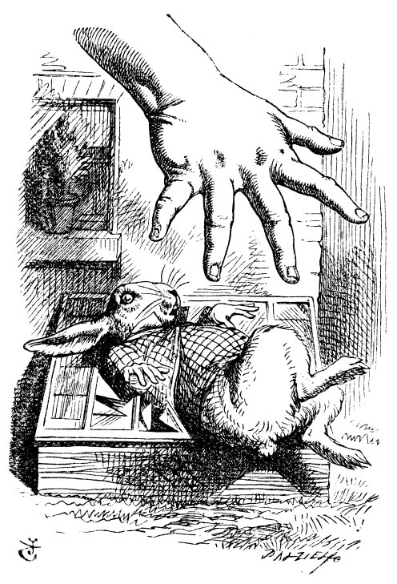

== The Rabbit Sends in a Little Bill

It was the White Rabbit, trotting slowly back again, and looking anxiously about as it went, as if it had lost something; and he heard it muttering to itself "The Duchess! The Duchess! Oh my dear paws! Oh my fur and whiskers! She'll get me executed, as sure as ferrets are ferrets! Where _can_ I have dropped them, I wonder?" Bob guessed in a moment that it was looking for the fan and the pair of white kid gloves, and he very good-naturedly began hunting about for them, but they were nowhere to be seen—everything seemed to have changed since his swim in the pool, and the great hall, with the glass table and the little door, had vanished completely.

Very soon the Rabbit noticed Bob, as he went hunting about, and called out to him in an angry tone, "Why, Mary Ann, what _are_ you doing out here? Run home this moment, and fetch me a pair of gloves and a fan! Quick, now!" And Bob was so much frightened that he ran off at once in the direction it pointed to, without trying to explain the mistake it had made.

"He took me for his housemaid," he said to himself as he ran. "How surprised he'll be when he finds out who I am! But I'd better take him his fan and gloves—that is, if I can find them." As he said this, he came upon a neat little house, on the door of which was a bright brass plate with the name "W. RABBIT," engraved upon it. He went in without knocking, and hurried upstairs, in great fear lest he should meet the real Mary Ann, and be turned out of the house before he had found the fan and gloves.

"How queer it seems," Bob said to himself, "to be going messages for a rabbit! I suppose Dinah'll be sending me on messages next!" And he began fancying the sort of thing that would happen: "'Mr. Bob! Come here directly, and get ready for your walk!' 'Coming in a minute, nurse! But I've got to see that the mouse doesn't get out.' Only I don't think," Bob went on, "that they'd let Dinah stop in the house if it began ordering people about like that!"

By this time he had found his way into a tidy little room with a table in the window, and on it (as he had hoped) a fan and two or three pairs of tiny white kid gloves: he took up the fan and a pair of the gloves, and was just going to leave the room, when his eye fell upon a little bottle that stood near the looking-glass. There was no label this time with the words "DRINK ME," but nevertheless he uncorked it and put it to his lips. "I know _something_ interesting is sure to happen," he said to himself, "whenever I eat or drink anything; so I'll just see what this bottle does. I do hope it'll make me grow large again, for really I'm quite tired of being such a tiny little thing!"

It did so indeed, and much sooner than he had expected: before he had drunk half the bottle, he found his head pressing against the ceiling, and had to stoop to save his neck from being broken. He hastily put down the bottle, saying to himself "That's quite enough—I hope I shan't grow any more—As it is, I can't get out at the door—I do wish I hadn't drunk quite so much!"

Alas! it was too late to wish that! He went on growing, and growing, and very soon had to kneel down on the floor: in another minute there was not even room for this, and he tried the effect of lying down with one elbow against the door, and the other arm curled round his head. Still he went on growing, and, as a last resource, he put one arm out of the window, and one foot up the chimney, and said to himself "Now I can do no more, whatever happens. What _will_ become of me?"

image::images/11.jpg[Bob cramped in Rabbit's house, align=center]

Luckily for Bob, the little magic bottle had now had its full effect, and he grew no larger: still it was very uncomfortable, and, as there seemed to be no sort of chance of his ever getting out of the room again, no wonder he felt unhappy.

"It was much pleasanter at home," thought poor Bob, "when one wasn't always growing larger and smaller, and being ordered about by mice and rabbits. I almost wish I hadn't gone down that rabbit-hole—and yet—and yet—it's rather curious, you know, this sort of life! I do wonder what _can_ have happened to me! When I used to read fairy-tales, I fancied that kind of thing never happened, and now here I am in the middle of one! There ought to be a book written about me, that there ought! And when I grow up, I'll write one—but I'm grown up now," he added in a sorrowful tone; "at least there's no room to grow up any more _here_."

"But then," thought Bob, "shall I _never_ get any older than I am now? That'll be a comfort, one way—never to be an old man—but then—always to have lessons to learn! Oh, I shouldn't like _that!_"

"Oh, you foolish Bob!" he answered himself. "How can you learn lessons in here? Why, there's hardly room for _you_, and no room at all for any lesson-books!"

And so he went on, taking first one side and then the other, and making quite a conversation of it altogether; but after a few minutes he heard a voice outside, and stopped to listen.

"Mary Ann! Mary Ann!" said the voice. "Fetch me my gloves this moment!" Then came a little pattering of feet on the stairs. Bob knew it was the Rabbit coming to look for him, and he trembled till he shook the house, quite forgetting that he was now about a thousand times as large as the Rabbit, and had no reason to be afraid of it.

Presently the Rabbit came up to the door, and tried to open it; but, as the door opened inwards, and Bob's elbow was pressed hard against it, that attempt proved a failure. Bob heard it say to itself "Then I'll go round and get in at the window."

"_That_ you won't!" thought Bob, and, after waiting till he fancied he heard the Rabbit just under the window, he suddenly spread out his hand, and made a snatch in the air. He did not get hold of anything, but he heard a little shriek and a fall, and a crash of broken glass, from which he concluded that it was just possible it had fallen into a cucumber-frame, or something of the sort.

Next came an angry voice—the Rabbit's—"Pat! Pat! Where are you?" And then a voice he had never heard before, "Sure then I'm here! Digging for apples, yer honour!"

"Digging for apples, indeed!" said the Rabbit angrily. "Here! Come and help me out of _this!_" (Sounds of more broken glass.)

"Now tell me, Pat, what's that in the window?"

"Sure, it's an arm, yer honour!" (He pronounced it "arrum.")

"An arm, you goose! Who ever saw one that size? Why, it fills the whole window!"

"Sure, it does, yer honour: but it's an arm for all that."

"Well, it's got no business there, at any rate: go and take it away!"

There was a long silence after this, and Bob could only hear whispers now and then; such as, "Sure, I don't like it, yer honour, at all, at all!" "Do as I tell you, you coward!" and at last he spread out his hand again, and made another snatch in the air. This time there were _two_ little shrieks, and more sounds of broken glass. "What a number of cucumber-frames there must be!" thought Bob. "I wonder what they'll do next! As for pulling me out of the window, I only wish they _could!_ I'm sure _I_ don't want to stay in here any longer!"

He waited for some time without hearing anything more: at last came a rumbling of little cartwheels, and the sound of a good many voices all talking together: he made out the words: "Where's the other ladder?—Why, I hadn't to bring but one; Bill's got the other—Bill! fetch it here, lad!—Here, put 'em up at this corner—No, tie 'em together first—they don't reach half high enough yet—Oh! they'll do well enough; don't be particular—Here, Bill! catch hold of this rope—Will the roof bear?—Mind that loose slate—Oh, it's coming down! Heads below!" (a loud crash)—"Now, who did that?—It was Bill, I fancy—Who's to go down the chimney?—Nay, _I_ shan't! _You_ do it!—_That_ I won't, then!—Bill's to go down—Here, Bill! the master says you're to go down the chimney!"

"Oh! So Bill's got to come down the chimney, has he?" said Bob to himself. "Shy, they seem to put everything upon Bill! I wouldn't be in Bill's place for a good deal: this fireplace is narrow, to be sure; but I _think_ I can kick a little!"

He drew his foot as far down the chimney as he could, and waited till he heard a little animal (he couldn't guess of what sort it was) scratching and scrambling about in the chimney close above him: then, saying to himself "This is Bill," he gave one sharp kick, and waited to see what would happen next.

The first thing he heard was a general chorus of "There goes Bill!" then the Rabbit's voice along—"Catch him, you by the hedge!" then silence, and then another confusion of voices—"Hold up his head—Brandy now—Don't choke him—How was it, old fellow? What happened to you? Tell us all about it!"

Last came a little feeble, squeaking voice, ("That's Bill," thought Bob,) "Well, I hardly know—No more, thank ye; I'm better now—but I'm a deal too flustered to tell you—all I know is, something comes at me like a Jack-in-the-box, and up I goes like a sky-rocket!"

image::images/13.jpg["There goes Bill!", align=center]

"So you did, old fellow!" said the others.

"We must burn the house down!" said the Rabbit's voice; and Bob called out as loud as he could, "If you do, I'll set Dinah at you!"

There was a dead silence instantly, and Bob thought to himself, "I wonder what they _will_ do next! If they had any sense, they'd take the roof off." After a minute or two, they began moving about again, and Bob heard the Rabbit say, "A barrowful will do, to begin with."

"A barrowful of _what?_" thought Bob; but he had not long to doubt, for the next moment a shower of little pebbles came rattling in at the window, and some of them hit him in the face. "I'll put a stop to this," he said to himself, and shouted out, "You'd better not do that again!" which produced another dead silence.

Bob noticed with some surprise that the pebbles were all turning into little cakes as they lay on the floor, and a bright idea came into his head. "If I eat one of these cakes," he thought, "it's sure to make _some_ change in my size; and as it can't possibly make me larger, it must make me smaller, I suppose."

So he swallowed one of the cakes, and was delighted to find that he began shrinking directly. As soon as he was small enough to get through the door, he ran out of the house, and found quite a crowd of little animals and birds waiting outside. The poor little Lizard, Bill, was in the middle, being held up by two guinea-pigs, who were giving it something out of a bottle. They all made a rush at Bob the moment he appeared; but he ran off as hard as he could, and soon found himself safe in a thick wood.

"The first thing I've got to do," said Bob to himself, as he wandered about in the wood, "is to grow to my right size again; and the second thing is to find my way into that lovely garden. I think that will be the best plan."

It sounded an excellent plan, no doubt, and very neatly and simply arranged; the only difficulty was, that he had not the smallest idea how to set about it; and while he was peering about anxiously among the trees, a little sharp bark just over his head made him look up in a great hurry.

An enormous puppy was looking down at him with large round eyes, and feebly stretching out one paw, trying to touch him. "Poor little thing!" said Bob, in a coaxing tone, and he tried hard to whistle to it; but he was terribly frightened all the time at the thought that it might be hungry, in which case it would be very likely to eat him up in spite of all his coaxing.

Hardly knowing what he did, he picked up a little bit of stick, and held it out to the puppy; whereupon the puppy jumped into the air off all its feet at once, with a yelp of delight, and rushed at the stick, and made believe to worry it; then Bob dodged behind a great thistle, to keep himself from being run over; and the moment he appeared on the other side, the puppy made another rush at the stick, and tumbled head over heels in its hurry to get hold of it; then Bob, thinking it was very like having a game of play with a cart-horse, and expecting every moment to be trampled under its feet, ran round the thistle again; then the puppy began a series of short charges at the stick, running a very little way forwards each time and a long way back, and barking hoarsely all the while, till at last it sat down a good way off, panting, with its tongue hanging out of its mouth, and its great eyes half shut.

image::images/14.jpg[Dog looking at tiny Bob, align=center]

This seemed to Bob a good opportunity for making his escape; so he set off at once, and ran till he was quite tired and out of breath, and till the puppy's bark sounded quite faint in the distance.

"And yet what a dear little puppy it was!" said Bob, as he leant against a buttercup to rest himself, and fanned himself with one of the leaves: "I should have liked teaching it tricks very much, if—if I'd only been the right size to do it! Oh dear! I'd nearly forgotten that I've got to grow up again! Let me see—how _is_ it to be managed? I suppose I ought to eat or drink something or other; but the great question is, what?"

The great question certainly was, what? Bob looked all round him at the flowers and the blades of grass, but he did not see anything that looked like the right thing to eat or drink under the circumstances. There was a large mushroom growing near him, about the same height as himself; and when he had looked under it, and on both sides of it, and behind it, it occurred to him that he might as well look and see what was on the top of it.

He stretched himself up on tiptoe, and peeped over the edge of the mushroom, and his eyes immediately met those of a large blue caterpillar, that was sitting on the top with its arms folded, quietly smoking a long hookah, and taking not the smallest notice of him or of anything else.
