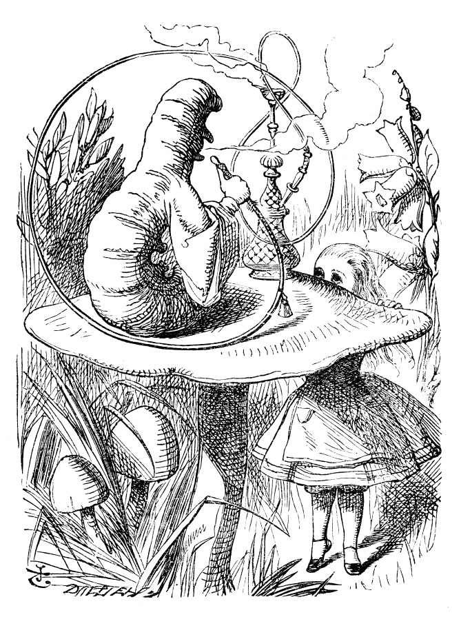
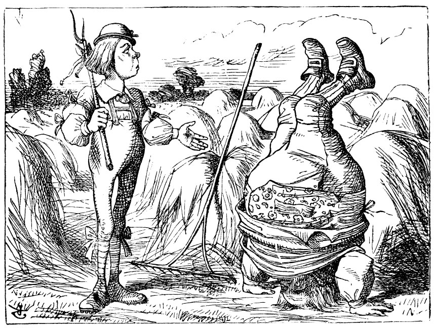
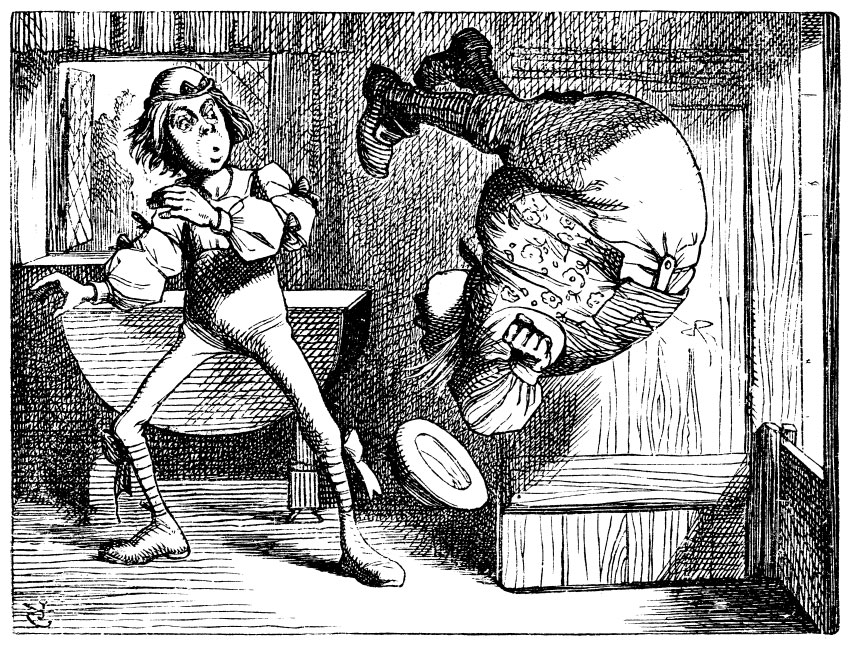
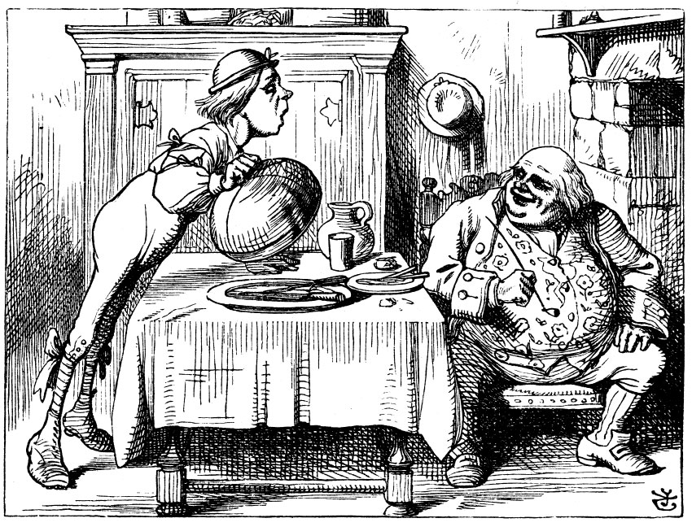
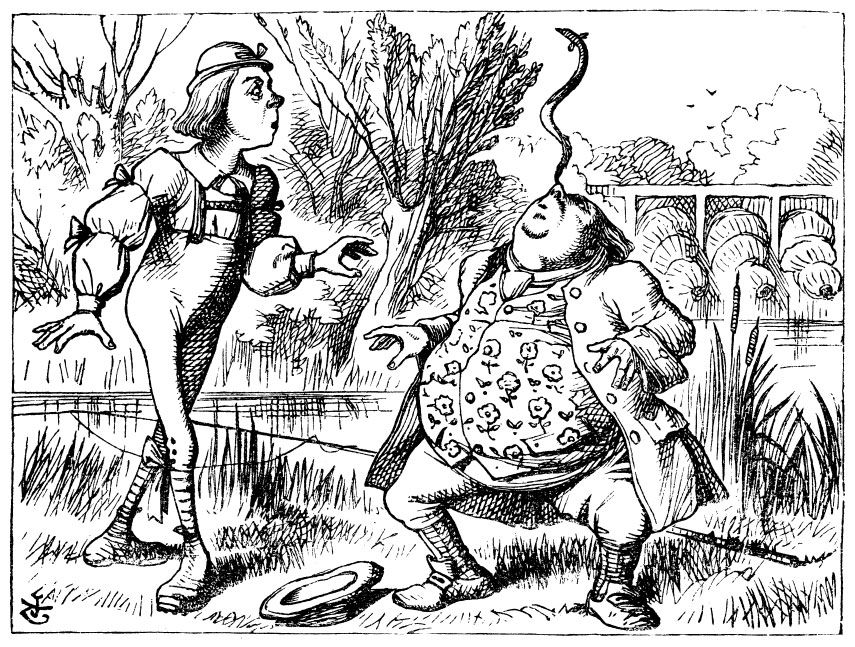

== Advice from a Caterpillar

The Caterpillar and Bob looked at each other for some time in silence: at last the Caterpillar took the hookah out of its mouth, and addressed him in a languid, sleepy voice.

"Who are _you?_" said the Caterpillar.

This was not an encouraging opening for a conversation. Bob replied, rather shyly, "I—I hardly know, sir, just at present—at least I know who I _was_ when I got up this morning, but I think I must have been changed several times since then."

"What do you mean by that?" said the Caterpillar sternly. "Explain yourself!"

"I can't explain _myself_, I'm afraid, sir," said Bob, "because I'm not myself, you see."

"I don't see," said the Caterpillar.

"I'm afraid I can't put it more clearly," Bob replied very politely, "for I can't understand it myself to begin with; and being so many different sizes in a day is very confusing."

"It isn't," said the Caterpillar.

"Well, perhaps you haven't found it so yet," said Bob; "but when you have to turn into a chrysalis—you will some day, you know—and then after that into a butterfly, I should think you'll feel it a little queer, won't you?"

"Not a bit," said the Caterpillar.

"Well, perhaps your feelings may be different," said Bob; "all I know is, it would feel very queer to _me_."

"You!" said the Caterpillar contemptuously. "Who are _you?_"

Which brought them back again to the beginning of the conversation. Bob felt a little irritated at the Caterpillar's making such _very_ short remarks, and he drew himself up and said, very gravely, "I think, you ought to tell me who _you_ are, first."

"Why?" said the Caterpillar.

Here was another puzzling question; and as Bob could not think of any good reason, and as the Caterpillar seemed to be in a _very_ unpleasant state of mind, he turned away.

"Come back!" the Caterpillar called after him. "I've something important to say!"

This sounded promising, certainly: Bob turned and came back again.

"Keep your temper," said the Caterpillar.

"Is that all?" said Bob, swallowing down his anger as well as he could.

"No," said the Caterpillar.

Bob thought he might as well wait, as he had nothing else to do, and perhaps after all it might tell him something worth hearing. For some minutes it puffed away without speaking, but at last it unfolded its arms, took the hookah out of its mouth again, and said, "So you think you're changed, do you?"

"I'm afraid I am, sir," said Bob; "I can't remember things as I used—and I don't keep the same size for ten minutes together!"

"Can't remember _what_ things?" said the Caterpillar.

"Well, I've tried to say 'How doth the little busy bee,' but it all came different!" Bob replied in a very melancholy voice.

"Repeat, '_You are old, Father William_,'" said the Caterpillar.

Bob folded his hands, and began:—

....
"You are old, Father William," the young man said,
    "And your hair has become very white;
And yet you incessantly stand on your head—
    Do you think, at your age, it is right?"

"In my youth," Father William replied to his son,
    "I feared it might injure the brain;
But, now that I'm perfectly sure I have none,
    Why, I do it again and again."
....

....
"You are old," said the youth, "as I mentioned before,
    And have grown most uncommonly fat;
Yet you turned a back-somersault in at the door—
    Pray, what is the reason of that?"

"In my youth," said the sage, as he shook his grey locks,
    "I kept all my limbs very supple
By the use of this ointment—one shilling the box—
    Allow me to sell you a couple?"
....

....
"You are old," said the youth, "and your jaws are too weak
    For anything tougher than suet;
Yet you finished the goose, with the bones and the beak—
    Pray, how did you manage to do it?"

"In my youth," said his father, "I took to the law,
    And argued each case with my wife;
And the muscular strength, which it gave to my jaw,
    Has lasted the rest of my life."
....

....
"You are old," said the youth, "one would hardly suppose
    That your eye was as steady as ever;
Yet you balanced an eel on the end of your nose—
    What made you so awfully clever?"

"I have answered three questions, and that is enough,"
    Said his father; "don't give yourself airs!
Do you think I can listen all day to such stuff?
    Be off, or I'll kick you down stairs!"
....

"That is not said right," said the Caterpillar.

"Not _quite_ right, I'm afraid," said Bob, timidly; "some of the words have got altered."

"It is wrong from beginning to end," said the Caterpillar decidedly, and there was silence for some minutes.

The Caterpillar was the first to speak.

"What size do you want to be?" it asked.

"Oh, I'm not particular as to size," Bob hastily replied; "only one doesn't like changing so often, you know."

"I _don't_ know," said the Caterpillar.

Bob said nothing: he had never been so much contradicted in his life before, and he felt that he was losing his temper.

"Are you content now?" said the Caterpillar.

"Well, I should like to be a _little_ larger, sir, if you wouldn't mind," said Bob: "three inches is such a wretched height to be."

"It is a very good height indeed!" said the Caterpillar angrily, rearing itself upright as it spoke (it was exactly three inches high).

"But I'm not used to it!" pleaded poor Bob in a piteous tone. And he thought to himself, "I wish the creatures wouldn't be so easily offended!"

"You'll get used to it in time," said the Caterpillar; and it put the hookah into its mouth and began smoking again.

This time Bob waited patiently until it chose to speak again. In a minute or two the Caterpillar took the hookah out of its mouth and yawned once or twice, and shook itself. Then it got down off the mushroom, and crawled away in the grass, merely remarking as it went, "One side will make you grow taller, and the other side will make you grow shorter."

"One side of _what?_ The other side of _what?_" thought Bob to himself.

"Of the mushroom," said the Caterpillar, just as if he had asked it aloud; and in another moment it was out of sight.

Bob remained looking thoughtfully at the mushroom for a minute, trying to make out which were the two sides of it; and as it was perfectly round, he found this a very difficult question. However, at last he stretched his arms round it as far as they would go, and broke off a bit of the edge with each hand.

"And now which is which?" he said to himself, and nibbled a little of the right-hand bit to try the effect: the next moment he felt a violent blow underneath his chin: it had struck his foot!

He was a good deal frightened by this very sudden change, but he felt that there was no time to be lost, as he was shrinking rapidly; so he set to work at once to eat some of the other bit. His chin was pressed so closely against his foot, that there was hardly room to open his mouth; but he did it at last, and managed to swallow a morsel of the lefthand bit.

'''

"Come, my head's free at last!" said Bob in a tone of delight, which changed into alarm in another moment, when he found that his shoulders were nowhere to be found: all he could see, when he looked down, was an immense length of neck, which seemed to rise like a stalk out of a sea of green leaves that lay far below him.

"What _can_ all that green stuff be?" said Bob. "And where _have_ my shoulders got to? And oh, my poor hands, how is it I can't see you?" He was moving them about as he spoke, but no result seemed to follow, except a little shaking among the distant green leaves.

As there seemed to be no chance of getting his hands up to his head, he tried to get his head down to them, and was delighted to find that his neck would bend about easily in any direction, like a serpent. He had just succeeded in curving it down into a graceful zigzag, and was going to dive in among the leaves, which he found to be nothing but the tops of the trees under which he had been wandering, when a sharp hiss made him draw back in a hurry: a large pigeon had flown into his face, and was beating him violently with its wings.

"Serpent!" screamed the Pigeon.

"I'm _not_ a serpent!" said Bob indignantly. "Let me alone!"

"Serpent, I say again!" repeated the Pigeon, but in a more subdued tone, and added with a kind of sob, "I've tried every way, and nothing seems to suit them!"

"I haven't the least idea what you're talking about," said Bob.

"I've tried the roots of trees, and I've tried banks, and I've tried hedges," the Pigeon went on, without attending to him; "but those serpents! There's no pleasing them!"

Bob was more and more puzzled, but he thought there was no use in saying anything more till the Pigeon had finished.

"As if it wasn't trouble enough hatching the eggs," said the Pigeon; "but I must be on the look-out for serpents night and day! Why, I haven't had a wink of sleep these three weeks!"

"I'm very sorry you've been annoyed," said Bob, who was beginning to see its meaning.

"And just as I'd taken the highest tree in the wood," continued the Pigeon, raising its voice to a shriek, "and just as I was thinking I should be free of them at last, they must needs come wriggling down from the sky! Ugh, Serpent!"

"But I'm _not_ a serpent, I tell you!" said Bob. "I'm a—I'm a—"

"Well! _What_ are you?" said the Pigeon. "I can see you're trying to invent something!"

"I—I'm a little boy," said Bob, rather doubtfully, as he remembered the number of changes he had gone through that day.

"A likely story indeed!" said the Pigeon in a tone of the deepest contempt. "I've seen a good many little boys in my time, but never _one_ with such a neck as that! No, no! You're a serpent; and there's no use denying it. I suppose you'll be telling me next that you never tasted an egg!"

"I _have_ tasted eggs, certainly," said Bob, who was a very truthful child; "but little boys eat eggs quite as much as serpents do, you know."

"I don't believe it," said the Pigeon; "but if they do, why then they're a kind of serpent, that's all I can say."

This was such a new idea to Bob, that he was quite silent for a minute or two, which gave the Pigeon the opportunity of adding, "You're looking for eggs, I know _that_ well enough; and what does it matter to me whether you're a little boy or a serpent?"

"It matters a great deal to _me_," said Bob hastily; "but I'm not looking for eggs, as it happens; and if I was, I shouldn't want _yours_: I don't like them raw."

"Well, be off, then!" said the Pigeon in a sulky tone, as it settled down again into its nest. Bob crouched down among the trees as well as he could, for his neck kept getting entangled among the branches, and every now and then he had to stop and untwist it. After a while he remembered that he still held the pieces of mushroom in his hands, and he set to work very carefully, nibbling first at one and then at the other, and growing sometimes taller and sometimes shorter, until he had succeeded in bringing himself down to his usual height.

It was so long since he had been anything near the right size, that it felt quite strange at first; but he got used to it in a few minutes, and began talking to himself, as usual. "Come, there's half my plan done now! How puzzling all these changes are! I'm never sure what I'm going to be, from one minute to another! However, I've got back to my right size: the next thing is, to get into that beautiful garden—how _is_ that to be done, I wonder?" As he said this, he came suddenly upon an open place, with a little house in it about four feet high. "Whoever lives there," thought Bob, "it'll never do to come upon them _this_ size: why, I should frighten them out of their wits!" So he began nibbling at the righthand bit again, and did not venture to go near the house till he had brought himself down to nine inches high.
