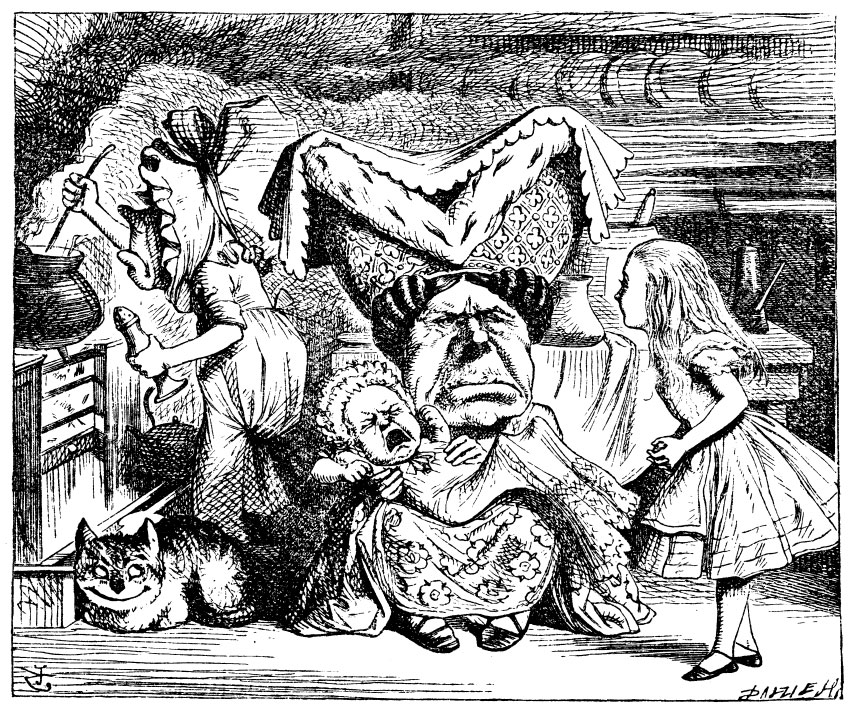
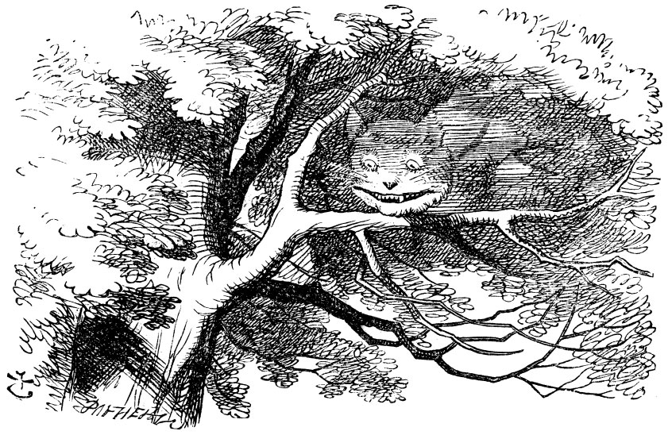

== Pig and Pepper

For a minute or two he stood looking at the house, and wondering what to do next, when suddenly a footman in livery came running out of the wood—(he considered him to be a footman because he was in livery: otherwise, judging by his face only, he would have called him a fish)—and rapped loudly at the door with his knuckles. It was opened by another footman in livery, with a round face, and large eyes like a frog; and both footmen, Bob noticed, had powdered hair that curled all over their heads. He felt very curious to know what it was all about, and crept a little way out of the wood to listen.

image::images/20.jpg[Fish and Frog servants, align=center]

The Fish-Footman began by producing from under his arm a great letter, nearly as large as himself, and this he handed over to the other, saying, in a solemn tone, "For the Duchess. An invitation from the Queen to play croquet." The Frog-Footman repeated, in the same solemn tone, only changing the order of the words a little, "From the Queen. An invitation for the Duchess to play croquet."

Then they both bowed low, and their curls got entangled together.

Bob laughed so much at this, that he had to run back into the wood for fear of their hearing him; and when he next peeped out the Fish-Footman was gone, and the other was sitting on the ground near the door, staring stupidly up into the sky.

Bob went timidly up to the door, and knocked.

"There's no sort of use in knocking," said the Footman, "and that for two reasons. First, because I'm on the same side of the door as you are; secondly, because they're making such a noise inside, no one could possibly hear you." And certainly there _was_ a most extraordinary noise going on within—a constant howling and sneezing, and every now and then a great crash, as if a dish or kettle had been broken to pieces.

"Please, then," said Bob, "how am I to get in?"

"There might be some sense in your knocking," the Footman went on without attending to him, "if we had the door between us. For instance, if you were _inside_, you might knock, and I could let you out, you know." He was looking up into the sky all the time he was speaking, and this Bob thought decidedly uncivil. "But perhaps he can't help it," he said to himself; "his eyes are so _very_ nearly at the top of his head. But at any rate he might answer questions.—How am I to get in?" he repeated, aloud.

"I shall sit here," the Footman remarked, "till tomorrow—"

At this moment the door of the house opened, and a large plate came skimming out, straight at the Footman's head: it just grazed his nose, and broke to pieces against one of the trees behind him.

"—or next day, maybe," the Footman continued in the same tone, exactly as if nothing had happened.

"How am I to get in?" asked Bob again, in a louder tone.

"_Are_ you to get in at all?" said the Footman. "That's the first question, you know."

It was, no doubt: only Bob did not like to be told so. "It's really dreadful," he muttered to himself, "the way all the creatures argue. It's enough to drive one crazy!"

The Footman seemed to think this a good opportunity for repeating his remark, with variations. "I shall sit here," he said, "on and off, for days and days."

"But what am _I_ to do?" said Bob.

"Anything you like," said the Footman, and began whistling.

"Oh, there's no use in talking to him," said Bob desperately: "he's perfectly idiotic!" And he opened the door and went in.

The door led right into a large kitchen, which was full of smoke from one end to the other: the Duchess was sitting on a three-legged stool in the middle, nursing a baby; the cook was leaning over the fire, stirring a large cauldron which seemed to be full of soup.

"There's certainly too much pepper in that soup!" Bob said to himself, as well as he could for sneezing.

There was certainly too much of it in the air. Even the Duchess sneezed occasionally; and as for the baby, it was sneezing and howling alternately without a moment's pause. The only things in the kitchen that did not sneeze, were the cook, and a large cat which was sitting on the hearth and grinning from ear to ear.

"Please would you tell me," said Bob, a little timidly, for he was not quite sure whether it was good manners for him to speak first, "why your cat grins like that?"

"It's a Cheshire cat," said the Duchess, "and that's why. Pig!"

She said the last word with such sudden violence that Bob quite jumped; but he saw in another moment that it was addressed to the baby, and not to him, so he took courage, and went on again:—

"I didn't know that Cheshire cats always grinned; in fact, I didn't know that cats could grin."

"They all can," said the Duchess; "and most of 'em do."

"I don't know of any that do," Bob said very politely, feeling quite pleased to have got into a conversation.

"You don't know much," said the Duchess; "and that's a fact."

Bob did not at all like the tone of this remark, and thought it would be as well to introduce some other subject of conversation. While he was trying to fix on one, the cook took the cauldron of soup off the fire, and at once set to work throwing everything within her reach at the Duchess and the baby—the fire-irons came first; then followed a shower of saucepans, plates, and dishes. The Duchess took no notice of them even when they hit her; and the baby was howling so much already, that it was quite impossible to say whether the blows hurt it or not.

"Oh, please mind what you're doing!" cried Bob, jumping up and down in an agony of terror. "Oh, there goes his precious nose!" as an unusually large saucepan flew close by it, and very nearly carried it off.

"If everybody minded their own business," the Duchess said in a hoarse growl, "the world would go round a deal faster than it does."

"Which would not be an advantage," said Bob, who felt very glad to get an opportunity of showing off a little of his knowledge. "Just think of what work it would make with the day and night! You see the earth takes twenty-four hours to turn round on its axis—"

"Talking of axes," said the Duchess, "chop off her head!"

Bob glanced rather anxiously at the cook, to see if she meant to take the hint; but the cook was busily stirring the soup, and seemed not to be listening, so he went on again: "Twenty-four hours, I think; or is it twelve? I—"

"Oh, don't bother me," said the Duchess; "I never could abide figures!" And with that she began nursing her child again, singing a sort of lullaby to it as she did so, and giving it a violent shake at the end of every line:

....
"Speak roughly to your little boy,
    And beat him when he sneezes:
He only does it to annoy,
    Because he knows it teases."

CHORUS.
(In which the cook and the baby joined):

"Wow! wow! wow!"

While the Duchess sang the second verse of the song, she kept tossing the baby violently up and down, and the poor little thing howled so, that Bob could hardly hear the words:—

"I speak severely to my boy,
    I beat him when he sneezes;
For he can thoroughly enjoy
    The pepper when he pleases!"

CHORUS.

"Wow! wow! wow!"
....

"Here! you may nurse it a bit, if you like!" the Duchess said to Bob, flinging the baby at him as she spoke. "I must go and get ready to play croquet with the Queen," and she hurried out of the room. The cook threw a frying-pan after her as she went out, but it just missed her.

Bob caught the baby with some difficulty, as it was a queer-shaped little creature, and held out its arms and legs in all directions, "just like a star-fish," thought Bob. The poor little thing was snorting like a steam-engine when he caught it, and kept doubling itself up and straightening itself out again, so that altogether, for the first minute or two, it was as much as he could do to hold it.

As soon as he had made out the proper way of nursing it, (which was to twist it up into a sort of knot, and then keep tight hold of its right ear and left foot, so as to prevent its undoing itself,) he carried it out into the open air. "If I don't take this child away with me," thought Bob, "they're sure to kill it in a day or two: wouldn't it be murder to leave it behind?" He said the last words out loud, and the little thing grunted in reply (it had left off sneezing by this time). "Don't grunt," said Bob; "that's not at all a proper way of expressing yourself."

The baby grunted again, and Bob looked very anxiously into its face to see what was the matter with it. There could be no doubt that it had a _very_ turn-up nose, much more like a snout than a real nose; also its eyes were getting extremely small for a baby: altogether Bob did not like the look of the thing at all. "But perhaps it was only sobbing," he thought, and looked into its eyes again, to see if there were any tears.

No, there were no tears. "If you're going to turn into a pig, my dear," said Bob, seriously, "I'll have nothing more to do with you. Mind now!" The poor little thing sobbed again (or grunted, it was impossible to say which), and they went on for some while in silence.

Bob was just beginning to think to himself, "Now, what am I to do with this creature when I get it home?" when it grunted again, so violently, that he looked down into its face in some alarm. This time there could be _no_ mistake about it: it was neither more nor less than a pig, and he felt that it would be quite absurd for him to carry it further.

image::images/22.jpg[Bob and pig baby, align=center]

So he set the little creature down, and felt quite relieved to see it trot away quietly into the wood. "If it had grown up," he said to himself, "it would have made a dreadfully ugly child: but it makes rather a handsome pig, I think." And he began thinking over other children he knew, who might do very well as pigs, and was just saying to himself, "if one only knew the right way to change them—" when he was a little startled by seeing the Cheshire Cat sitting on a bough of a tree a few yards off.

The Cat only grinned when it saw Bob. It looked good-natured, he thought: still it had _very_ long claws and a great many teeth, so he felt that it ought to be treated with respect.

"Cheshire Puss," he began, rather timidly, as he did not at all know whether it would like the name: however, it only grinned a little wider. "Come, it's pleased so far," thought Bob, and he went on. "Would you tell me, please, which way I ought to go from here?"

"That depends a good deal on where you want to get to," said the Cat.

"I don't much care where—" said Bob.

"Then it doesn't matter which way you go," said the Cat.

"—so long as I get _somewhere_," Bob added as an explanation.

image::images/23.jpg[Bob speaks to Cheshire Cat, align=center]

"Oh, you're sure to do that," said the Cat, "if you only walk long enough."

Bob felt that this could not be denied, so he tried another question. "What sort of people live about here?"

"In _that_ direction," the Cat said, waving its right paw round, "lives a Hatter: and in _that_ direction," waving the other paw, "lives a March Hare. Visit either you like: they're both mad."

"But I don't want to go among mad people," Bob remarked.

"Oh, you can't help that," said the Cat: "we're all mad here. I'm mad. You're mad."

"How do you know I'm mad?" said Bob.

"You must be," said the Cat, "or you wouldn't have come here."

Bob didn't think that proved it at all; however, he went on "And how do you know that you're mad?"

"To begin with," said the Cat, "a dog's not mad. You grant that?"

"I suppose so," said Bob.

"Well, then," the Cat went on, "you see, a dog growls when it's angry, and wags its tail when it's pleased. Now _I_ growl when I'm pleased, and wag my tail when I'm angry. Therefore I'm mad."

"_I_ call it purring, not growling," said Bob.

"Call it what you like," said the Cat. "Do you play croquet with the Queen to-day?"

"I should like it very much," said Bob, "but I haven't been invited yet."

"You'll see me there," said the Cat, and vanished.

Bob was not much surprised at this, he was getting so used to queer things happening. While he was looking at the place where it had been, it suddenly appeared again.

"By-the-bye, what became of the baby?" said the Cat. "I'd nearly forgotten to ask."

"It turned into a pig," Bob quietly said, just as if it had come back in a natural way.

"I thought it would," said the Cat, and vanished again.

Bob waited a little, half expecting to see it again, but it did not appear, and after a minute or two he walked on in the direction in which the March Hare was said to live. "I've seen hatters before," he said to himself; "the March Hare will be much the most interesting, and perhaps as this is May it won't be raving mad—at least not so mad as it was in March." As he said this, he looked up, and there was the Cat again, sitting on a branch of a tree.

"Did you say pig, or fig?" said the Cat.

"I said pig," replied Bob; "and I wish you wouldn't keep appearing and vanishing so suddenly: you make one quite giddy."

"All right," said the Cat; and this time it vanished quite slowly, beginning with the end of the tail, and ending with the grin, which remained some time after the rest of it had gone.

"Well! I've often seen a cat without a grin," thought Bob; "but a grin without a cat! It's the most curious thing I ever saw in my life!"

He had not gone much farther before he came in sight of the house of the March Hare: he thought it must be the right house, because the chimneys were shaped like ears and the roof was thatched with fur. It was so large a house, that he did not like to go nearer till he had nibbled some more of the lefthand bit of mushroom, and raised himself to about two feet high: even then he walked up towards it rather timidly, saying to himself "Suppose it should be raving mad after all! I almost wish I'd gone to see the Hatter instead!"
