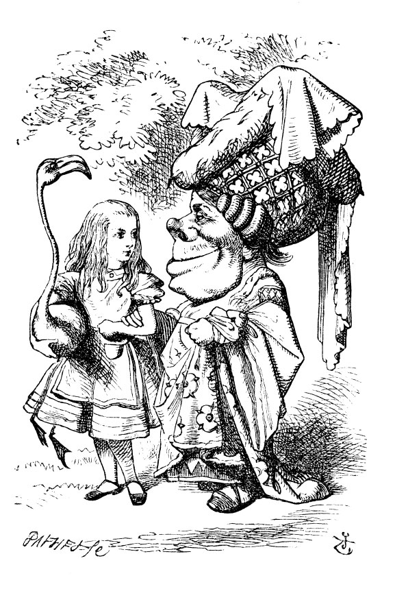

== The Mock Turtle's Story

"You can't think how glad I am to see you again, you dear old thing!" said the Duchess, as she tucked her arm affectionately into Bob's, and they walked off together.

Bob was very glad to find her in such a pleasant temper, and thought to himself that perhaps it was only the pepper that had made her so savage when they met in the kitchen.

"When _I'm_ a Duke," he said to himself, (not in a very hopeful tone though), "I won't have any pepper in my kitchen _at all_. Soup does very well without—Maybe it's always pepper that makes people hot-tempered," he went on, very much pleased at having found out a new kind of rule, "and vinegar that makes them sour—and camomile that makes them bitter—and—and barley-sugar and such things that make children sweet-tempered. I only wish people knew _that_: then they wouldn't be so stingy about it, you know—"

He had quite forgotten the Duchess by this time, and was a little startled when he heard her voice close to his ear. "You're thinking about something, my dear, and that makes you forget to talk. I can't tell you just now what the moral of that is, but I shall remember it in a bit."

"Perhaps it hasn't one," Bob ventured to remark.

"Tut, tut, child!" said the Duchess. "Everything's got a moral, if only you can find it." And she squeezed herself up closer to Bob's side as she spoke.

Bob did not much like keeping so close to her: first, because the Duchess was _very_ ugly; and secondly, because she was exactly the right height to rest her chin upon Bob's shoulder, and it was an uncomfortably sharp chin. However, he did not like to be rude, so he bore it as well as he could.

"The game's going on rather better now," he said, by way of keeping up the conversation a little.

"'Tis so," said the Duchess: "and the moral of that is—'Oh, 'tis love, 'tis love, that makes the world go round!'"

"Somebody said," Bob whispered, "that it's done by everybody minding their own business!"

"Ah, well! It means much the same thing," said the Duchess, digging her sharp little chin into Bob's shoulder as she added, "and the moral of _that_ is—'Take care of the sense, and the sounds will take care of themselves.'"

"How fond she is of finding morals in things!" Bob thought to himself.

"I dare say you're wondering why I don't put my arm round your waist," the Duchess said after a pause: "the reason is, that I'm doubtful about the temper of your flamingo. Shall I try the experiment?"

"He might bite," Bob cautiously replied, not feeling at all anxious to have the experiment tried.

"Very true," said the Duchess: "flamingoes and mustard both bite. And the moral of that is—'Birds of a feather flock together.'"

"Only mustard isn't a bird," Bob remarked.

"Right, as usual," said the Duchess: "what a clear way you have of putting things!"

"It's a mineral, I _think_," said Bob.

"Of course it is," said the Duchess, who seemed ready to agree to everything that Bob said; "there's a large mustard-mine near here. And the moral of that is—'The more there is of mine, the less there is of yours.'"

"Oh, I know!" exclaimed Bob, who had not attended to this last remark, "it's a vegetable. It doesn't look like one, but it is."

"I quite agree with you," said the Duchess; "and the moral of that is—'Be what you would seem to be'—or if you'd like it put more simply—'Never imagine yourself not to be otherwise than what it might appear to others that what you were or might have been was not otherwise than what you had been would have appeared to them to be otherwise.'"

"I think I should understand that better," Bob said very politely, "if I had it written down: but I can't quite follow it as you say it."

"That's nothing to what I could say if I chose," the Duchess replied, in a pleased tone.

"Pray don't trouble yourself to say it any longer than that," said Bob.

"Oh, don't talk about trouble!" said the Duchess. "I make you a present of everything I've said as yet."

"A cheap sort of present!" thought Bob. "I'm glad they don't give birthday presents like that!" But he did not venture to say it out loud.

"Thinking again?" the Duchess asked, with another dig of her sharp little chin.

"I've a right to think," said Bob sharply, for he was beginning to feel a little worried.

"Just about as much right," said the Duchess, "as pigs have to fly; and the m—"

But here, to Bob's great surprise, the Duchess's voice died away, even in the middle of her favourite word 'moral,' and the arm that was linked into his began to tremble. Bob looked up, and there stood the Queen in front of them, with her arms folded, frowning like a thunderstorm.

"A fine day, your Majesty!" the Duchess began in a low, weak voice.

"Now, I give you fair warning," shouted the Queen, stamping on the ground as she spoke; "either you or your head must be off, and that in about half no time! Take your choice!"

The Duchess took her choice, and was gone in a moment.

"Let's go on with the game," the Queen said to Bob; and Bob was too much frightened to say a word, but slowly followed her back to the croquet-ground.

The other guests had taken advantage of the Queen's absence, and were resting in the shade: however, the moment they saw her, they hurried back to the game, the Queen merely remarking that a moment's delay would cost them their lives.

All the time they were playing the Queen never left off quarrelling with the other players, and shouting "Off with his head!" or "Off with her head!" Those whom she sentenced were taken into custody by the soldiers, who of course had to leave off being arches to do this, so that by the end of half an hour or so there were no arches left, and all the players, except the King, the Queen, and Bob, were in custody and under sentence of execution.

Then the Queen left off, quite out of breath, and said to Bob, "Have you seen the Mock Turtle yet?"

"No," said Bob. "I don't even know what a Mock Turtle is."

"It's the thing Mock Turtle Soup is made from," said the Queen.

"I never saw one, or heard of one," said Bob.

"Come on, then," said the Queen, "and he shall tell you his history,"

As they walked off together, Bob heard the King say in a low voice, to the company generally, "You are all pardoned." "Come, _that's_ a good thing!" he said to himself, for he had felt quite unhappy at the number of executions the Queen had ordered.

image::images/33.jpg[Gryphon asleep, align=center]

They very soon came upon a Gryphon, lying fast asleep in the sun. (If you don't know what a Gryphon is, look at the picture.) "Up, lazy thing!" said the Queen, "and take this young man to see the Mock Turtle, and to hear his history. I must go back and see after some executions I have ordered;" and she walked off, leaving Bob alone with the Gryphon. Bob did not quite like the look of the creature, but on the whole he thought it would be quite as safe to stay with it as to go after that savage Queen: so he waited.

The Gryphon sat up and rubbed its eyes: then it watched the Queen till she was out of sight: then it chuckled. "What fun!" said the Gryphon, half to itself, half to Bob.

"What _is_ the fun?" said Bob.

"Why, _she_," said the Gryphon. "It's all her fancy, that: they never executes nobody, you know. Come on!"

"Everybody says 'come on!' here," thought Bob, as he went slowly after it: "I never was so ordered about in all my life, never!"

They had not gone far before they saw the Mock Turtle in the distance, sitting sad and lonely on a little ledge of rock, and, as they came nearer, Bob could hear him sighing as if his heart would break. He pitied him deeply. "What is his sorrow?" he asked the Gryphon, and the Gryphon answered, very nearly in the same words as before, "It's all his fancy, that: he hasn't got no sorrow, you know. Come on!"

So they went up to the Mock Turtle, who looked at them with large eyes full of tears, but said nothing.

"This here young man," said the Gryphon, "he wants for to know your history, he do."

"I'll tell it him," said the Mock Turtle in a deep, hollow tone: "sit down, both of you, and don't speak a word till I've finished."

So they sat down, and nobody spoke for some minutes. Bob thought to himself, "I don't see how he can _ever_ finish, if he doesn't begin." But he waited patiently.

"Once," said the Mock Turtle at last, with a deep sigh, "I was a real Turtle."

image::images/34.jpg[Mock Turtle and Gryphon singing to Bob, align=center]

These words were followed by a very long silence, broken only by an occasional exclamation of "Hjckrrh!" from the Gryphon, and the constant heavy sobbing of the Mock Turtle. Bob was very nearly getting up and saying, "Thank you, sir, for your interesting story," but he could not help thinking there _must_ be more to come, so he sat still and said nothing.

"When we were little," the Mock Turtle went on at last, more calmly, though still sobbing a little now and then, "we went to school in the sea. The master was an old Turtle—we used to call him Tortoise—"

"Why did you call him Tortoise, if he wasn't one?" Bob asked.

"We called him Tortoise because he taught us," said the Mock Turtle angrily: "really you are very dull!"

"You ought to be ashamed of yourself for asking such a simple question," added the Gryphon; and then they both sat silent and looked at poor Bob, who felt ready to sink into the earth. At last the Gryphon said to the Mock Turtle, "Drive on, old fellow! Don't be all day about it!" and he went on in these words:

"Yes, we went to school in the sea, though you mayn't believe it—"

"I never said I didn't!" interrupted Bob.

"You did," said the Mock Turtle.

"Hold your tongue!" added the Gryphon, before Bob could speak again. The Mock Turtle went on.

"We had the best of educations—in fact, we went to school every day—"

"_I've_ been to a day-school, too," said Bob; "you needn't be so proud as all that."

"With extras?" asked the Mock Turtle a little anxiously.

"Yes," said Bob, "we learned French and music."

"And washing?" said the Mock Turtle.

"Certainly not!" said Bob indignantly.

"Ah! then yours wasn't a really good school," said the Mock Turtle in a tone of great relief. "Now at _ours_ they had at the end of the bill, 'French, music, _and washing_—extra.'"

"You couldn't have wanted it much," said Bob; "living at the bottom of the sea."

"I couldn't afford to learn it." said the Mock Turtle with a sigh. "I only took the regular course."

"What was that?" inquired Bob.

"Reeling and Writhing, of course, to begin with," the Mock Turtle replied; "and then the different branches of Arithmetic—Ambition, Distraction, Uglification, and Derision."

"I never heard of 'Uglification,'" Bob ventured to say. "What is it?"

The Gryphon lifted up both its paws in surprise. "What! Never heard of uglifying!" it exclaimed. "You know what to beautify is, I suppose?"

"Yes," said Bob doubtfully: "it means—to—make—anything—prettier."

"Well, then," the Gryphon went on, "if you don't know what to uglify is, you _are_ a simpleton."

Bob did not feel encouraged to ask any more questions about it, so he turned to the Mock Turtle, and said "What else had you to learn?"

"Well, there was Mystery," the Mock Turtle replied, counting off the subjects on his flappers, "—Mystery, ancient and modern, with Seaography: then Drawling—the Drawling-master was an old conger-eel, that used to come once a week: _he_ taught us Drawling, Stretching, and Fainting in Coils."

"What was _that_ like?" said Bob.

"Well, I can't show it you myself," the Mock Turtle said: "I'm too stiff. And the Gryphon never learnt it."

"Hadn't time," said the Gryphon: "I went to the Classics master, though. He was an old crab, _he_ was."

"I never went to him," the Mock Turtle said with a sigh: "he taught Laughing and Grief, they used to say."

"So he did, so he did," said the Gryphon, sighing in his turn; and both creatures hid their faces in their paws.

"And how many hours a day did you do lessons?" said Bob, in a hurry to change the subject.

"Ten hours the first day," said the Mock Turtle: "nine the next, and so on."

"What a curious plan!" exclaimed Bob.

"That's the reason they're called lessons," the Gryphon remarked: "because they lessen from day to day."

This was quite a new idea to Bob, and he thought it over a little before he made his next remark. "Then the eleventh day must have been a holiday?"

"Of course it was," said the Mock Turtle.

"And how did you manage on the twelfth?" Bob went on eagerly.

"That's enough about lessons," the Gryphon interrupted in a very decided tone: "tell him something about the games now."
